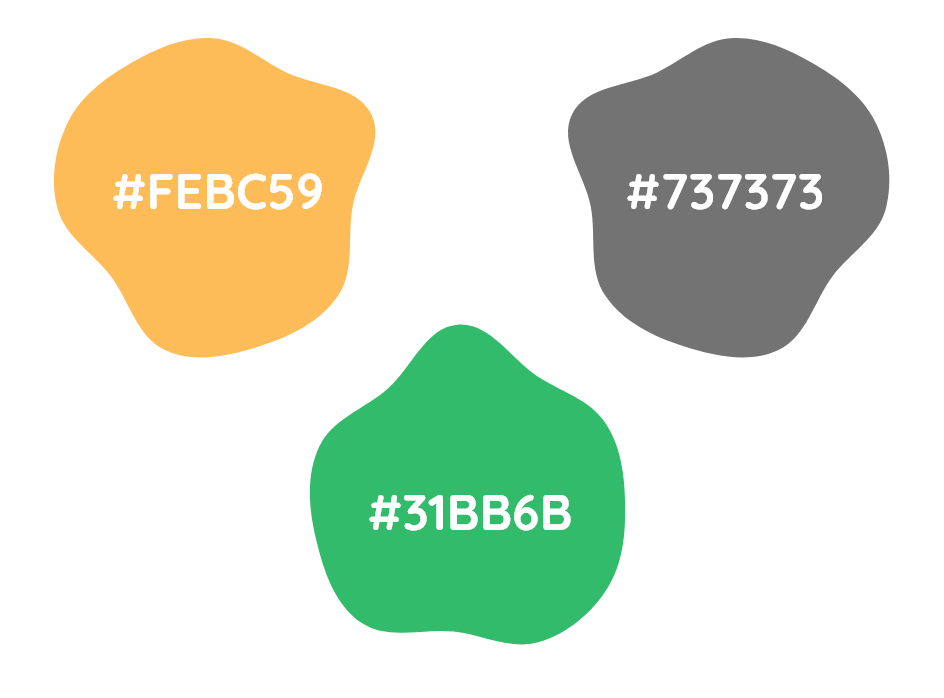

We have centralized the location of all the files we use to create our logos.

[Our official logo formats](https://github.com/PalisadoesFoundation/talawa-docs/tree/master/static/img/logos) can be found here.
## Idea
Our logo is made up of 2 shapes, circle & rectangle, it represents,

1. "**Talawa**" in the Jamaican dialect means "**Strong**", and there is a saying "**Little, but Talawa**", which translates to "**Little, but Strong**".
2. We used Palisadoes Foundation logo's elements and colors to preserve the core ideologies.

## Clear space
The logo needs to have clear space, free of text, pictures, and other elements.

## Color
**Dark Background** or **White Background** logos can be used and in-case they are not suitable, **Transparent** ones can be used without altering the clear space rules.
The primary colors of our logo are,

 - #31BB6B - Medium Sea Green
 - #FEBC59 - Max Yellow Red
 - #737373 - Sonic Silver

### Color Palette

