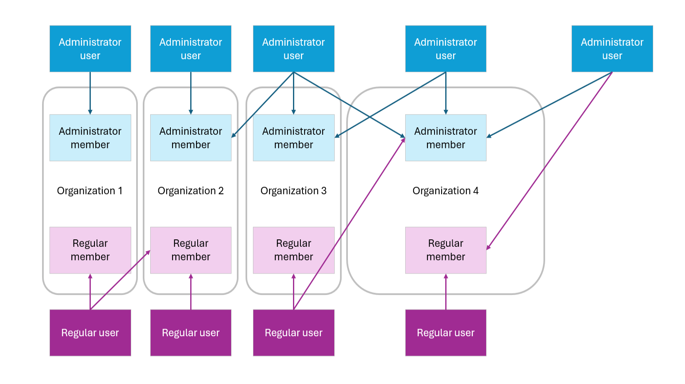

To use and contribute to Talawa effectively, you'll need to understand these important concepts.

## Introduction

Use this diagram as a reference in the sections below.

## Community​

Communities are groups of people who participate either directly or indirectly with an installation of the suite of Talawa apps. Each instance of the Talawa API only manages a single community.

- **Example**: A community could be a club that has members across an entire country, state or city.

Communities can have multiple organizations in them, in other words, it is the parent organization.

## Organizations

Groups of people in a community that have some unique commonality.

- **Example**: A national club could create a Talawa community that covers a country, then each organization could cover the club's followers in each city.

Organizations act as hubs of volunteer activity.

## People in Communities

There are two broad categories of people in communities.

1. **Users**: These are people who are in the Talawa database.
2. **Members**: These are people in the database who are registered with an organization.

### Community Roles

People in communities have roles.

1. There are two user roles: administrator & regular
1. There are two organization member roles for now: administrator and regular

There are very important differences between a user and an organization member:

1. A user with `administrator` role is the highest privileged entity in the application:
   1. they can view any user or organization data,
   2. they don't need to join any organization to moderate them, but they can if they want to,
   3. they can also choose whatever member role they want in an organization,
   4. they can be a `regular` member of an organization. This doesn't change their highest privilege in the application and their ability to moderate that organization.
2. A user with `regular` role has the lowest privileged in the application:
   1. they can join organizations and by default they'll be assigned a `regular` member role within those organizations until a user with `administrator` role elevates their privileges to an `administrator` member role within that organization.
3. A user with an `administrator` member role within organizations:
   1. is the highest privilege member within those organizations,
   2. they have most privileges that users with `administrator` roles have within the context of a particular organization, but there are some privileges exclusive to users with `administrator` roles
4. A user with a `regular` member role within organizations are members of the lowest privilege within those organizations

In summary: Users with cases 1, 2 and 3 have the same privileges; users with cases 4, 5 and 6 have differing privileges

1. `administrator` user role, member of none of the organizations
2. `administrator` user role, `administrator` member role in 1 or more organizations
3. `administrator` user role, `regular` member role in 1 or more organizations
4. `regular` user role, member of none of the organizations
5. `regular` user role, `administrator` member role in 1 or more organizations
6. `regular` user role, `regular` member role in 1 or more organizations

**Note**: Support for users who don't use either the mobile or web apps is a feature that needs to be added.

### PostgreSQL Changes

In the MongoDB implementation, each user would have an `AppUserProfile`.

1. This would be `Null` if they didn't use Talawa but were added to the database for tracking purposes. Not everyone is online.
2. For online users the `AppUserProfile` would track:
   1. Events created
   2. Organizations created
   3. Campaigns created
   4. Pledges created
   5. Other related capabilities

This approach was taken because MongoDB had limited RDBMS capabilities and this solution was used to mimic them. PostgreSQL tracks this information in its tables where the creator of each table row is tracked.

## Talawa Application Users

The Talawa applications are used by different groups of people.

1. **Talawa**: All people associated with an organization. There are no administrative functions incorporated in the mobile app.
2. **Talawa-Admin**: This repository combines two separate and partially overlapping portals
   1. The Administrator Portal: Only Administrators use this web portal. It is used to manage the Community users and Organization members. No other users have access.
   2. The User Portal: All users have access to this portal that lacks administrative features.

Talawa-API supports the users of Talawa and Talawa-Admin.

There are no administrative functions incorporated in the mobile app by design because phone screens are generally too small to provide a full featured experience. We also don't have the volunteer resources to manage the expanded functionality at this time.

## Events

Event management is a major Talawa component. Anyone can create events using either Talawa client.

### 1. Event Terminologies

Here are some important terminologies used in Talawa event management:

- **Open Event**: Events that are open to everyone
- **Registrable Event**: An open event that requires the additional step of event registration. These events would typically have limited capacity and therefore would require members to register beforehand.
- **Closed Events**: These are events that are by invitation only.
  - **Private events**: Closed events that only show up in the mobile app calendars of invitees

### 2. Event Features

Events have many features as you can see below.

- **Event Creation**

Events can:

1. be created either in either Talawa client;
1. only be edited by the event organizers and admins

- **Event Checkins**

Checkins are a way of tracking attendance to all types of events. They have many valuable uses such as the ability to:

1. add users to the organization if they turn up to an event;
1. convert users to members when they attend an event.

- **Event Group Chats**

Talawa includes the ability of members invited or registered to an event to automatically be added to a group chat for that event. This allows greater coordination and community spirit in the organization's groups.

- **Event Roles**

Talawa includes the ability of members attending events to become volunteers and/or assigned action items that can be tracked in their app by all attendees. This helps in event management.

## Newsfeed

The Talawa newsfeed helps to make the Communities a more cohesive entity.

### Mobile App Newsfeed

The newsfeed on the Talawa Mobile App is a stream of commentary from the App's users. This may include various combinations of text, video, images and links that Members may want to share.

Talawa Mobile App users only get news on their newsfeed for the organization that they are currently actively using.

Members using the app can add posts containing text, images or video to the newsfeed. They can also add hashtags to their posts. People seeing the hashtags will be able to click on them to automatically filter their feed by one or more hashtags.

### Admin Panel Newsfeed

Administrators will use Talawa-Admin to administer an organization's newsfeed. At a minimum they will get a filtered version of the feed that only includes exceptional content that requires attention. This includes:

1. **Pinned Posts**: The management of pinned posts that they use to alert all members of the organization of some activity. These posts are [always visible at the top of the newsfeed](https://github.com/PalisadoesFoundation/talawa-api/issues/1096). Pinned posts can only be created by Administrators.
2. **Reported Posts**: Mobile App users may want Administrators to take action on posts that don't match the organization's values. Administrators can use the newsfeed to manage these reports.
3. **Plugin Posts**: The Administrator panel may have plugins that need to access the newsfeed. For example these could include the insertion of advertising from local companies.

## Action Items

The assignment of action items are not just limited to events.

Administrators can assign action items to any member of their organizations to help with the tracking of general and non-event related activities.
