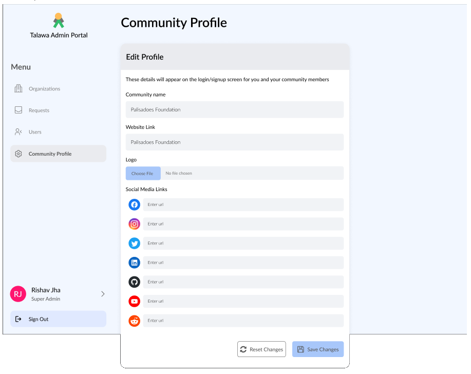
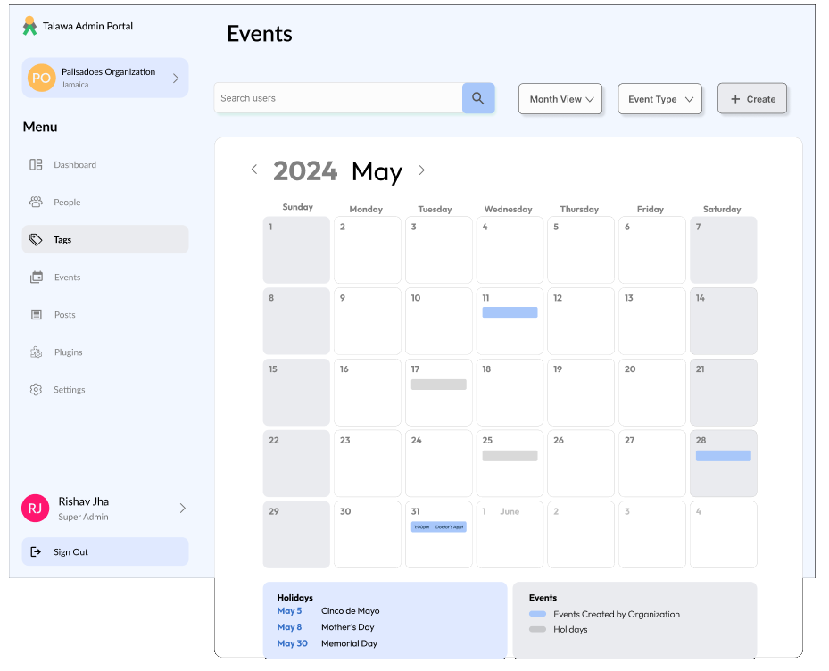
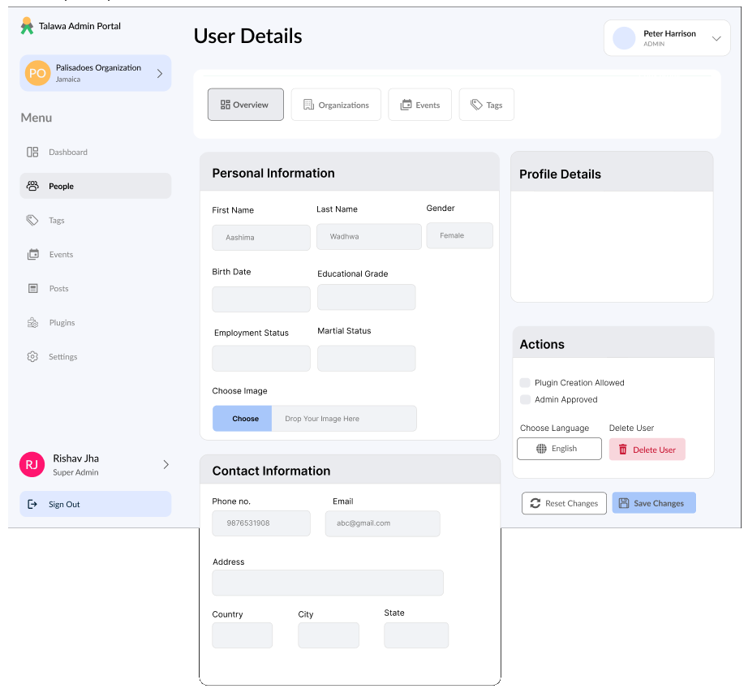
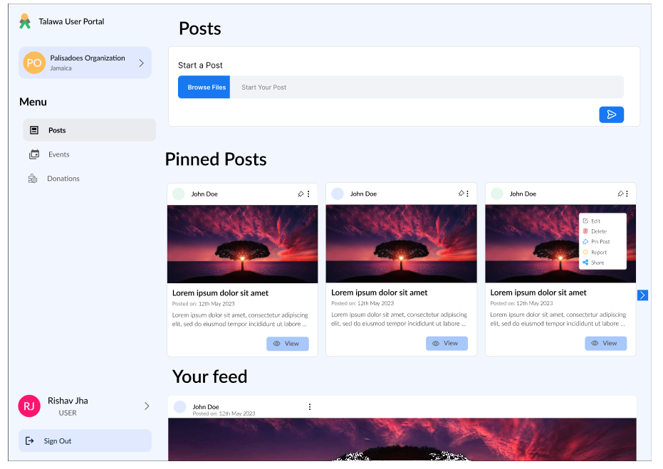

Here are some screen shots to give you an idea of the extensive features Talawa offers

## Community Profile Page

The Community profile allows you to customize your login screen with:

1. Your own logo
2. Links to your social media accounts

## Organization Event Calendar

Keep track of all the events in your organization through the events calendar

## Organization User Profile

Keep track of your organization members via their profile page.

1. Create tags for groups of members so that it's easier for you to find them by the filter of your choice, skills, availability and more!
2. See what events they are attending

## Organization News Feed

Customize your organization's private social media environment:

1. Create pinned posts at the top of your feed for important announcements.
2. Insert advertising from local sponsors in the feed too.

